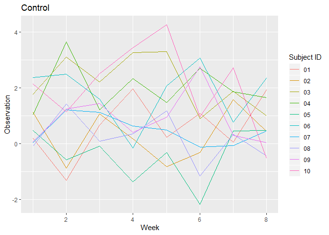
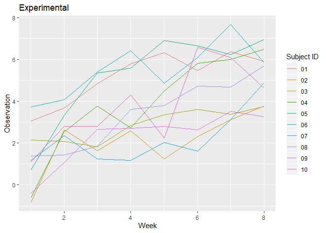
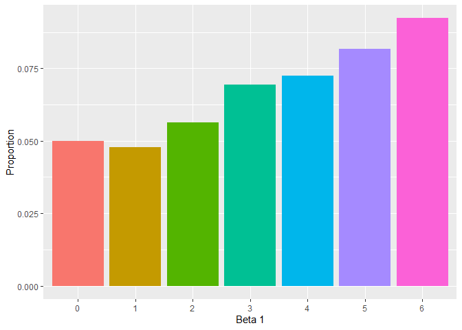
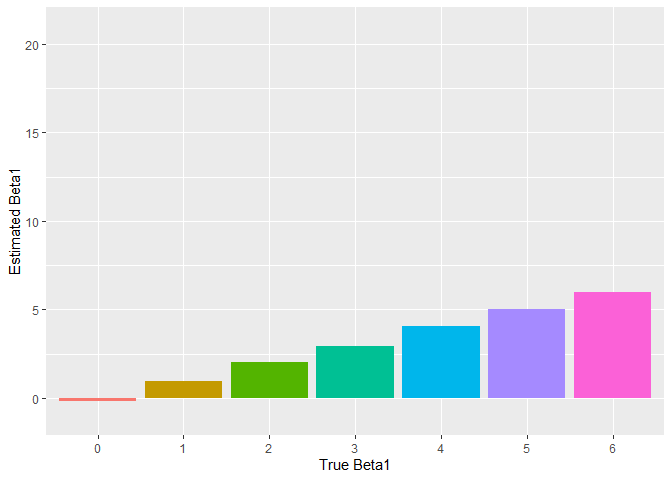

p8105\_hw5\_mfc2162
================
Madeline Cannon
11/3/2019

## Problem 1

#### Load data and introduce missing values

``` r
library(tidyverse)
```

    ## -- Attaching packages ------------------------------------------------- tidyverse 1.2.1 --

    ## v ggplot2 3.2.0     v purrr   0.3.2
    ## v tibble  2.1.3     v dplyr   0.8.3
    ## v tidyr   1.0.0     v stringr 1.4.0
    ## v readr   1.3.1     v forcats 0.4.0

    ## -- Conflicts ---------------------------------------------------- tidyverse_conflicts() --
    ## x dplyr::filter() masks stats::filter()
    ## x dplyr::lag()    masks stats::lag()

``` r
set.seed(10)

iris_with_missing = iris %>% 
  map_df(~replace(.x, sample(1:150, 20), NA)) %>%
  mutate(Species = as.character(Species))
```

#### Function to fill missing values

``` r
fill_missing = function(vector) {
  if (is.numeric(vector)) {
    v_mean = mean(vector, na.rm=TRUE)
    vector[is.na(vector)] = v_mean
  }
  if (is.character(vector)) {
    vector[is.na(vector)] = "virginica"
  }
  return(vector)
}
```

#### Apply to dataset using map

``` r
iris_with_missing = map_df(iris_with_missing, fill_missing)
iris_with_missing
```

    ## # A tibble: 150 x 5
    ##    Sepal.Length Sepal.Width Petal.Length Petal.Width Species
    ##           <dbl>       <dbl>        <dbl>       <dbl> <chr>  
    ##  1         5.1          3.5         1.4         0.2  setosa 
    ##  2         4.9          3           1.4         0.2  setosa 
    ##  3         4.7          3.2         1.3         0.2  setosa 
    ##  4         4.6          3.1         1.5         1.19 setosa 
    ##  5         5            3.6         1.4         0.2  setosa 
    ##  6         5.4          3.9         1.7         0.4  setosa 
    ##  7         5.82         3.4         1.4         0.3  setosa 
    ##  8         5            3.4         1.5         0.2  setosa 
    ##  9         4.4          2.9         1.4         0.2  setosa 
    ## 10         4.9          3.1         3.77        0.1  setosa 
    ## # ... with 140 more rows

## Problem 2

#### Read in data for each subject

``` r
files = list.files("./data")
study = data.frame()

get_data = function(file_name) {
  path = paste("./data/", file_name, sep = "")
  subject_data = read_csv(path)
  row = cbind(file_name, subject_data)
  study = rbind(study, row)
}

wide = map_dfr(files, get_data)
```

    ## Parsed with column specification:
    ## cols(
    ##   week_1 = col_double(),
    ##   week_2 = col_double(),
    ##   week_3 = col_double(),
    ##   week_4 = col_double(),
    ##   week_5 = col_double(),
    ##   week_6 = col_double(),
    ##   week_7 = col_double(),
    ##   week_8 = col_double()
    ## )
    ## Parsed with column specification:
    ## cols(
    ##   week_1 = col_double(),
    ##   week_2 = col_double(),
    ##   week_3 = col_double(),
    ##   week_4 = col_double(),
    ##   week_5 = col_double(),
    ##   week_6 = col_double(),
    ##   week_7 = col_double(),
    ##   week_8 = col_double()
    ## )
    ## Parsed with column specification:
    ## cols(
    ##   week_1 = col_double(),
    ##   week_2 = col_double(),
    ##   week_3 = col_double(),
    ##   week_4 = col_double(),
    ##   week_5 = col_double(),
    ##   week_6 = col_double(),
    ##   week_7 = col_double(),
    ##   week_8 = col_double()
    ## )
    ## Parsed with column specification:
    ## cols(
    ##   week_1 = col_double(),
    ##   week_2 = col_double(),
    ##   week_3 = col_double(),
    ##   week_4 = col_double(),
    ##   week_5 = col_double(),
    ##   week_6 = col_double(),
    ##   week_7 = col_double(),
    ##   week_8 = col_double()
    ## )
    ## Parsed with column specification:
    ## cols(
    ##   week_1 = col_double(),
    ##   week_2 = col_double(),
    ##   week_3 = col_double(),
    ##   week_4 = col_double(),
    ##   week_5 = col_double(),
    ##   week_6 = col_double(),
    ##   week_7 = col_double(),
    ##   week_8 = col_double()
    ## )
    ## Parsed with column specification:
    ## cols(
    ##   week_1 = col_double(),
    ##   week_2 = col_double(),
    ##   week_3 = col_double(),
    ##   week_4 = col_double(),
    ##   week_5 = col_double(),
    ##   week_6 = col_double(),
    ##   week_7 = col_double(),
    ##   week_8 = col_double()
    ## )
    ## Parsed with column specification:
    ## cols(
    ##   week_1 = col_double(),
    ##   week_2 = col_double(),
    ##   week_3 = col_double(),
    ##   week_4 = col_double(),
    ##   week_5 = col_double(),
    ##   week_6 = col_double(),
    ##   week_7 = col_double(),
    ##   week_8 = col_double()
    ## )
    ## Parsed with column specification:
    ## cols(
    ##   week_1 = col_double(),
    ##   week_2 = col_double(),
    ##   week_3 = col_double(),
    ##   week_4 = col_double(),
    ##   week_5 = col_double(),
    ##   week_6 = col_double(),
    ##   week_7 = col_double(),
    ##   week_8 = col_double()
    ## )
    ## Parsed with column specification:
    ## cols(
    ##   week_1 = col_double(),
    ##   week_2 = col_double(),
    ##   week_3 = col_double(),
    ##   week_4 = col_double(),
    ##   week_5 = col_double(),
    ##   week_6 = col_double(),
    ##   week_7 = col_double(),
    ##   week_8 = col_double()
    ## )
    ## Parsed with column specification:
    ## cols(
    ##   week_1 = col_double(),
    ##   week_2 = col_double(),
    ##   week_3 = col_double(),
    ##   week_4 = col_double(),
    ##   week_5 = col_double(),
    ##   week_6 = col_double(),
    ##   week_7 = col_double(),
    ##   week_8 = col_double()
    ## )
    ## Parsed with column specification:
    ## cols(
    ##   week_1 = col_double(),
    ##   week_2 = col_double(),
    ##   week_3 = col_double(),
    ##   week_4 = col_double(),
    ##   week_5 = col_double(),
    ##   week_6 = col_double(),
    ##   week_7 = col_double(),
    ##   week_8 = col_double()
    ## )
    ## Parsed with column specification:
    ## cols(
    ##   week_1 = col_double(),
    ##   week_2 = col_double(),
    ##   week_3 = col_double(),
    ##   week_4 = col_double(),
    ##   week_5 = col_double(),
    ##   week_6 = col_double(),
    ##   week_7 = col_double(),
    ##   week_8 = col_double()
    ## )
    ## Parsed with column specification:
    ## cols(
    ##   week_1 = col_double(),
    ##   week_2 = col_double(),
    ##   week_3 = col_double(),
    ##   week_4 = col_double(),
    ##   week_5 = col_double(),
    ##   week_6 = col_double(),
    ##   week_7 = col_double(),
    ##   week_8 = col_double()
    ## )
    ## Parsed with column specification:
    ## cols(
    ##   week_1 = col_double(),
    ##   week_2 = col_double(),
    ##   week_3 = col_double(),
    ##   week_4 = col_double(),
    ##   week_5 = col_double(),
    ##   week_6 = col_double(),
    ##   week_7 = col_double(),
    ##   week_8 = col_double()
    ## )
    ## Parsed with column specification:
    ## cols(
    ##   week_1 = col_double(),
    ##   week_2 = col_double(),
    ##   week_3 = col_double(),
    ##   week_4 = col_double(),
    ##   week_5 = col_double(),
    ##   week_6 = col_double(),
    ##   week_7 = col_double(),
    ##   week_8 = col_double()
    ## )
    ## Parsed with column specification:
    ## cols(
    ##   week_1 = col_double(),
    ##   week_2 = col_double(),
    ##   week_3 = col_double(),
    ##   week_4 = col_double(),
    ##   week_5 = col_double(),
    ##   week_6 = col_double(),
    ##   week_7 = col_double(),
    ##   week_8 = col_double()
    ## )
    ## Parsed with column specification:
    ## cols(
    ##   week_1 = col_double(),
    ##   week_2 = col_double(),
    ##   week_3 = col_double(),
    ##   week_4 = col_double(),
    ##   week_5 = col_double(),
    ##   week_6 = col_double(),
    ##   week_7 = col_double(),
    ##   week_8 = col_double()
    ## )
    ## Parsed with column specification:
    ## cols(
    ##   week_1 = col_double(),
    ##   week_2 = col_double(),
    ##   week_3 = col_double(),
    ##   week_4 = col_double(),
    ##   week_5 = col_double(),
    ##   week_6 = col_double(),
    ##   week_7 = col_double(),
    ##   week_8 = col_double()
    ## )
    ## Parsed with column specification:
    ## cols(
    ##   week_1 = col_double(),
    ##   week_2 = col_double(),
    ##   week_3 = col_double(),
    ##   week_4 = col_double(),
    ##   week_5 = col_double(),
    ##   week_6 = col_double(),
    ##   week_7 = col_double(),
    ##   week_8 = col_double()
    ## )
    ## Parsed with column specification:
    ## cols(
    ##   week_1 = col_double(),
    ##   week_2 = col_double(),
    ##   week_3 = col_double(),
    ##   week_4 = col_double(),
    ##   week_5 = col_double(),
    ##   week_6 = col_double(),
    ##   week_7 = col_double(),
    ##   week_8 = col_double()
    ## )

    ## Warning in bind_rows_(x, .id): Unequal factor levels: coercing to character

    ## Warning in bind_rows_(x, .id): binding character and factor vector,
    ## coercing into character vector
    
    ## Warning in bind_rows_(x, .id): binding character and factor vector,
    ## coercing into character vector
    
    ## Warning in bind_rows_(x, .id): binding character and factor vector,
    ## coercing into character vector
    
    ## Warning in bind_rows_(x, .id): binding character and factor vector,
    ## coercing into character vector
    
    ## Warning in bind_rows_(x, .id): binding character and factor vector,
    ## coercing into character vector
    
    ## Warning in bind_rows_(x, .id): binding character and factor vector,
    ## coercing into character vector
    
    ## Warning in bind_rows_(x, .id): binding character and factor vector,
    ## coercing into character vector
    
    ## Warning in bind_rows_(x, .id): binding character and factor vector,
    ## coercing into character vector
    
    ## Warning in bind_rows_(x, .id): binding character and factor vector,
    ## coercing into character vector
    
    ## Warning in bind_rows_(x, .id): binding character and factor vector,
    ## coercing into character vector
    
    ## Warning in bind_rows_(x, .id): binding character and factor vector,
    ## coercing into character vector
    
    ## Warning in bind_rows_(x, .id): binding character and factor vector,
    ## coercing into character vector
    
    ## Warning in bind_rows_(x, .id): binding character and factor vector,
    ## coercing into character vector
    
    ## Warning in bind_rows_(x, .id): binding character and factor vector,
    ## coercing into character vector
    
    ## Warning in bind_rows_(x, .id): binding character and factor vector,
    ## coercing into character vector
    
    ## Warning in bind_rows_(x, .id): binding character and factor vector,
    ## coercing into character vector
    
    ## Warning in bind_rows_(x, .id): binding character and factor vector,
    ## coercing into character vector
    
    ## Warning in bind_rows_(x, .id): binding character and factor vector,
    ## coercing into character vector
    
    ## Warning in bind_rows_(x, .id): binding character and factor vector,
    ## coercing into character vector
    
    ## Warning in bind_rows_(x, .id): binding character and factor vector,
    ## coercing into character vector

#### Tidy data

``` r
study = wide %>%
  pivot_longer(week_1:week_8,
               names_to = "week",
               names_prefix = "week_",
               values_to = "observation") %>%
  mutate(id = substr(file_name, start = 5, stop = 6),
         arm = substr(file_name, start = 1, stop = 3),
         week = as.numeric(week)) %>%
  select(id, arm, week, observation)

study
```

    ## # A tibble: 160 x 4
    ##    id    arm    week observation
    ##    <chr> <chr> <dbl>       <dbl>
    ##  1 01    con       1        0.2 
    ##  2 01    con       2       -1.31
    ##  3 01    con       3        0.66
    ##  4 01    con       4        1.96
    ##  5 01    con       5        0.23
    ##  6 01    con       6        1.09
    ##  7 01    con       7        0.05
    ##  8 01    con       8        1.94
    ##  9 02    con       1        1.13
    ## 10 02    con       2       -0.88
    ## # ... with 150 more rows

#### Spaghetti plots

``` r
control = study %>% filter(arm == "con")
experimental = study %>% filter(arm == "exp")

ggplot(data = control, aes(x = week, y = observation, color = id)) +
  geom_line() + xlab("Week") + ylab("Observation") + labs(color = "Subject ID") +
  ggtitle("Control")
```

<!-- -->

``` r
ggplot(data = experimental, aes(x = week, y = observation, color = id)) +
  geom_line() + xlab("Week") + ylab("Observation") + labs(color = "Subject ID") +
  ggtitle("Experimental")
```

<!-- -->

In the control group, the observations do not appear to change with
time. In the experimental group, the observations clearly increase over
time.

## Problem 3

#### Generate datasets

``` r
set.seed(1)

sim_regression = function(n = 30, beta0 = 2, beta1) {
  
  sim_data = tibble(
    x = rnorm(n, mean = 0, sd = 1),
    y = beta0 + beta1 * x + rnorm(n, 0 ,50)
  )
  
  ls_fit = lm(y ~ x, data = sim_data)
  results = ls_fit %>% broom::tidy() %>% filter(term == "x")
  
  tibble(
    b1_hat = coef(ls_fit)[2],
    p_value = pull(results, p.value)
  )
}


sim_results = 
  tibble(b1 = c(0, 1, 2, 3, 4, 5, 6)) %>% 
  mutate(
    output_lists = map(.x = b1, ~rerun(10000, sim_regression(beta1 = .x))),
    estimate_dfs = map(output_lists, bind_rows)) %>% 
  select(-output_lists) %>% 
  unnest(estimate_dfs)

sim_results = sim_results %>% mutate(b1 = as.factor(b1))
```

#### Proportion of times the null was rejected

``` r
sim_results = sim_results %>% mutate(reject_null = 0)

for (row in 1:nrow(sim_results)) {
  if (sim_results[row, "p_value"] < 0.05) {
    sim_results[row, "reject_null"] = 1
  }
}

power_plot = sim_results %>% group_by(b1) %>%
  summarize(proportion = sum(reject_null) / n())

ggplot(power_plot, aes(x=b1, y=proportion, fill=b1)) + geom_bar(stat="identity") +
  xlab("Beta 1") + ylab("Proportion") + theme(legend.position = "none")
```

<!-- -->

As effect size increases, the power increases.

#### Average estimator of beta

``` r
estimator_plot = sim_results %>% group_by(b1) %>%
  summarize(avg_est = mean(b1_hat))

ggplot(estimator_plot, aes(x=b1, y=avg_est, fill=b1)) + geom_bar(stat="identity") +
  xlab("True Beta 1") + ylab("Estimated Beta 1") + theme(legend.position = "none")
```

<!-- -->
